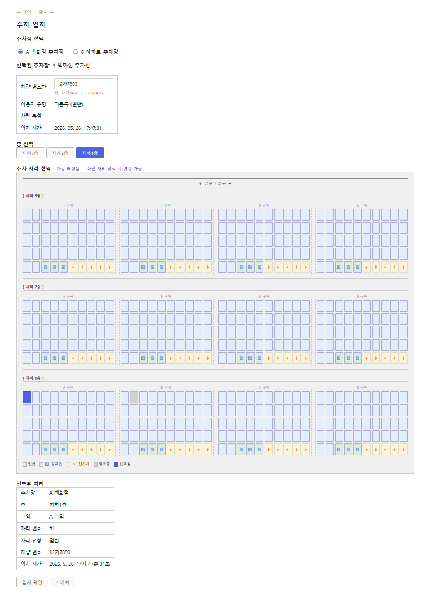
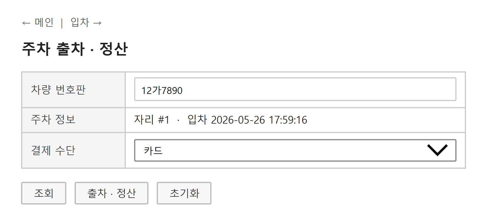
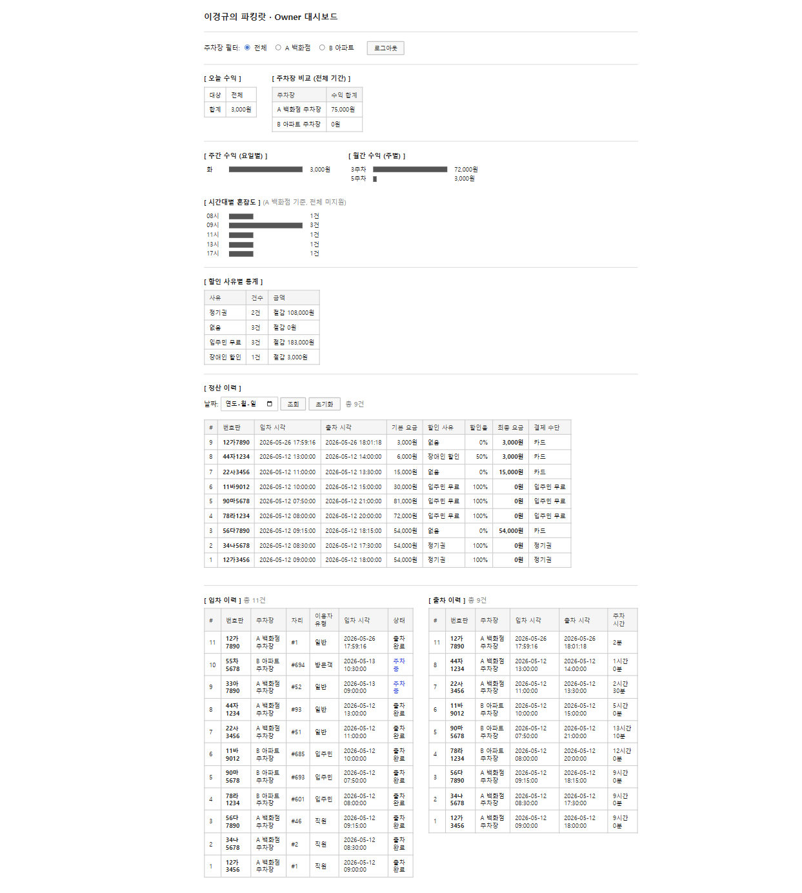
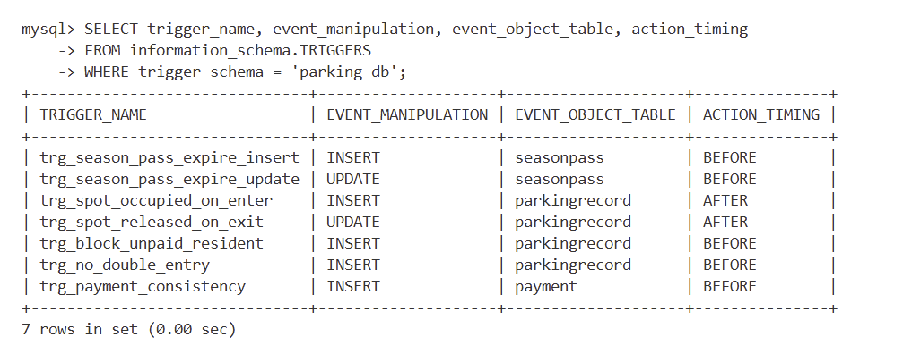
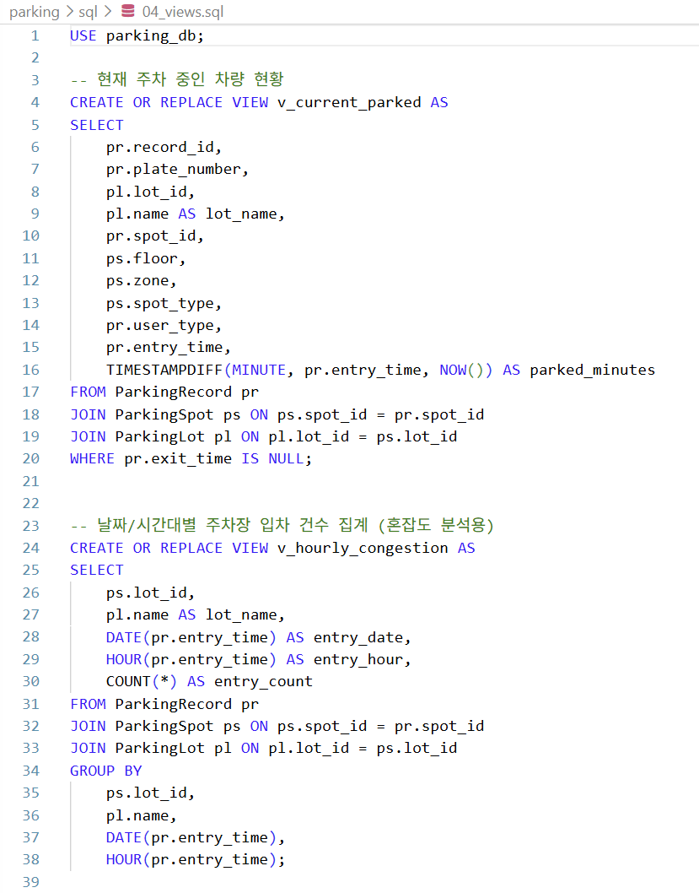
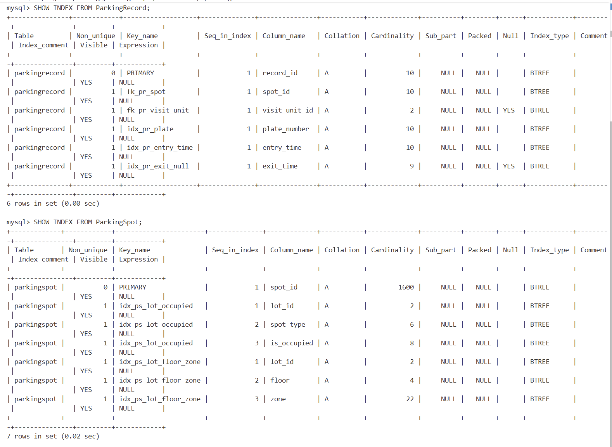

# 이경규의 파킹랏

백화점 + 아파트 복합 시설 통합 주차 관리 시스템

Flask, PyMySQL, MySQL 8.0, HTML/CSS/JS

---

## 프로젝트 개요

백화점과 아파트 주차장을 하나의 웹 서비스로 관리하는 시스템입니다.

| | A 백화점 주차장 (Lot 1) | B 아파트 주차장 (Lot 2) |
|---|---|---|
| 층 | 지하 1~3층 | 지하 1층 |
| 구역 | A~L (12구역) | P~Y (10구역) |
| 총 자리 | 600자리 | 1,000자리 |
| 구역당 구성 | 일반 42 + 장애인 3 + 전기차 5 = 50 | 일반 84 + 장애인 8 + 전기차 8 = 100 |

### A 백화점 주차장 요금 (일반 / 방문객 / 직원)

| 유형 | 요금 | 비고 |
|------|------|------|
| 일반 | 30분당 3,000원 | |
| 방문객 | 30분당 3,000원 | 방문 세대 ID 필요 |
| 직원 (정기권 有) | 무료 | 유효한 정기권 필요 |
| 직원 (정기권 無) | 30분당 3,000원 | |

### B 아파트 주차장 요금 (입주민 / 방문객)

| 유형 | 요금 | 비고 |
|------|------|------|
| 입주민 | 무료 | 관리비 전월 미납 시 입차 차단 |
| 방문객 | 30분당 3,000원 | 방문 세대 ID 필요 |

### 공통 — 차량 특성별 적용

| 차량 유형 | 적용 | 비고 |
|-----------|------|------|
| 장애인 차량 | 요금 50% 할인 | 장애인 전용 자리만 이용 가능 |
| 전기차 | 요금 변동 없음 | 전기차 전용 자리만 이용 가능 |

---

## 화면 구성

### 메인


### 입차 — 주차장 선택 후 평면도에서 자리 확인 및 입차



### 출차 — 번호판 입력 → 주차 시간 + 요금 자동 계산




### 관리자 대시보드 — 매출 통계, 시간대별 혼잡도, 입출차 및 결제 이력



---

## DB 설계

### 테이블 구조

| 테이블 | 설명 |
|--------|------|
| `ParkingLot` | 주차장 정보 |
| `ParkingSpot` | 주차 자리 (층, 구역, 타입, 점유 여부) |
| `ParkingRecord` | 입출차 기록 |
| `Payment` | 결제 정보 (원래 요금, 할인율, 최종 요금, 결제 수단) |
| `Vehicle` | 차량 (번호판, 장애인차 또는 전기차 여부) |
| `AptUnit` | 아파트 세대 |
| `AptResident` | 입주민 ↔ 차량 연결 |
| `AptMonthlyPayment` | 관리비 납부 이력 |
| `DeptEmployee` | 직원 ↔ 차량 연결 |
| `SeasonPass` | 직원 정기권 |
| `AppUser` | 관리자 계정 (비밀번호는 MySQL SHA2-256 해싱) |
| `Visitor` | 방문객 사전 등록 |

### 저장 프로시저

입차와 출차+정산 로직을 트랜잭션으로 묶어 처리합니다.  
중간에 오류가 나면 자동으로 롤백됩니다.

**`sp_park_enter`** — 입차 처리

1. 자리 점유 여부 확인
2. 장애인/전기차 전용 자리 차량 검증
3. 입주민이면 관리비 미납 확인 (전월까지 미납 있으면 차단)
4. `ParkingRecord` 삽입

**`sp_park_exit`** — 출차 + 정산

1. 주차 시간 계산 (30분 단위, 초 단위 올림, 최소 1단위)
2. 할인 사유 결정 (정기권 직원 → 입주민 → 장애인 → 일반)
3. `Payment` 삽입


### 트리거 (7개)

| 트리거 | 시점 | 설명 |
|--------|------|------|
| `trg_spot_occupied_on_enter` | AFTER INSERT ParkingRecord | 입차 시 자리 점유 표시 |
| `trg_spot_released_on_exit` | AFTER UPDATE ParkingRecord | 출차 시 자리 해제 |
| `trg_no_double_entry` | BEFORE INSERT ParkingRecord | 같은 차량 이중 입차 차단 |
| `trg_block_unpaid_resident` | BEFORE INSERT ParkingRecord | 관리비 미납 입주민 입차 차단 |
| `trg_payment_consistency` | BEFORE INSERT Payment | 할인율 및 최종금액 일관성 검증 |
| `trg_season_pass_expire_insert` | BEFORE INSERT SeasonPass | 만료일 지난 정기권 비활성 처리 |
| `trg_season_pass_expire_update` | BEFORE UPDATE SeasonPass | 정기권 기간 변경 시 활성 상태 재계산 |



### 뷰 (2개)

**`v_current_parked`** — 현재 주차 중인 차량 목록  
(입차 시간, 경과 분 포함 — 대시보드 실시간 조회에 사용)

**`v_hourly_congestion`** — 시간대별 입차 건수 집계  
(대시보드 혼잡도 차트에 사용)



### 인덱스 (8개)

| 인덱스 | 대상 | 용도 |
|--------|------|------|
| `idx_pr_plate` | ParkingRecord.plate_number | 번호판으로 입출차 이력 조회 |
| `idx_pr_entry_time` | ParkingRecord.entry_time | 시간대별 혼잡도 집계 |
| `idx_pr_exit_null` | ParkingRecord.exit_time | 현재 주차 중인 차량 조회 |
| `idx_ps_lot_occupied` | ParkingSpot(lot_id, spot_type, is_occupied) | 빈 자리 검색 |
| `idx_ps_lot_floor_zone` | ParkingSpot(lot_id, floor, zone) | 평면도 렌더링 |
| `idx_sp_employee_active` | SeasonPass(employee_id, is_active) | 직원 정기권 확인 |
| `idx_amp_unit_paid` | AptMonthlyPayment(unit_id, is_paid) | 관리비 미납 확인 |
| `idx_pay_method` | Payment.method | 결제 수단별 집계 |



---


DB 계정은 두 개로 분리되어 있습니다.  
`parking_user` — 입차/출차 등 일반 사용자 요청 (SELECT, EXECUTE만 가능)  
`parking_admin` — 관리자가 통계 및 이력 조회 (전체 권한)

---

## 실행 방법

### 1. 저장소 클론

```bash
git clone https://github.com/gyulim2/parking.git
cd parking
```

### 2. DB 계정 및 스키마 세팅

`sql/` 폴더 파일을 **순서대로** 실행합니다.  
Windows는 인코딩 문제로 `--default-character-set=utf8mb4`를 붙여야 합니다.

```bash
# DB 계정 생성 (가장 먼저 실행)
mysql -u root -p --default-character-set=utf8mb4 < sql/00_mysql_users.sql

# 스키마, 트리거, 프로시저, 뷰, 인덱스, 데이터
mysql -u root -p --default-character-set=utf8mb4 < sql/01_schema.sql
mysql -u root -p --default-character-set=utf8mb4 < sql/02_triggers.sql
mysql -u root -p --default-character-set=utf8mb4 < sql/03_procedures.sql
mysql -u root -p --default-character-set=utf8mb4 < sql/04_views.sql
mysql -u root -p --default-character-set=utf8mb4 < sql/05_indexes.sql
mysql -u root -p --default-character-set=utf8mb4 < sql/06_dummy_data.sql
mysql -u root -p --default-character-set=utf8mb4 < sql/07_events.sql
```

### 3. 환경 변수 설정

```bash
cd backend
cp .env.example .env
```

`.env` 파일을 열어서 DB 접속 정보를 입력합니다.  
기본값은 `00_mysql_users.sql`에서 설정한 값과 동일합니다.

```
DB_ADMIN_USER=parking_admin
DB_ADMIN_PASSWORD=admin1234
DB_USER=parking_user
DB_PASSWORD=user1234
DB_HOST=localhost
DB_PORT=3306
DB_NAME=parking_db
FLASK_SECRET_KEY=아무문자열
```

### 4. 패키지 설치 및 서버 실행

```bash
pip install -r requirements.txt
python app.py
```

`http://localhost:5000` 접속

---

## 테스트용 더미 데이터

- 차량 10대, 입출차 기록 10건, 결제 완료 8건
- 관리자 계정 : `admin` / `admin1234`

**A 백화점 주차장 (Lot 1)**
- 지하 1~3층, A~L구역, 구역당 50자리 (일반 42 + 장애인 3 + 전기차 5)
- 총 600자리

**B 아파트 주차장 (Lot 2)**
- 지하 1층, P~Y구역, 구역당 100자리 (일반 84 + 장애인 8 + 전기차 8)
- 총 1,000자리


